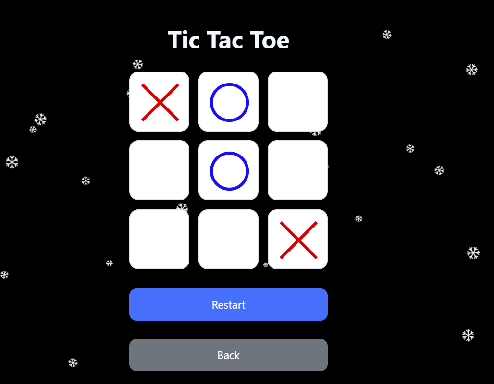

# Web-Dev-Project
Tic Tac Toe game for Web Dev Final Project

## Instructions
### 1.

Run the following in a local directory where you want to install the project through your command line:

`git clone https://github.com/AnthonyCiceuOTU/Web-Dev-Project.git`

### 2.

Ensure you have Node.js and npm installed

### 3.

Run in your command line:

`npm install better-sqlite3`

### 4.

Run in your command line:

`npm install express`

### 5.
Run `npm rebuild` then `node server.js` in the command line after navigating to 
\Web-Dev-Project\Web_Dev_Group_Project

### 6.
Open the html file or the Localhost

## Features
- Two difficulties
- Stats page
- Intelligent AI on Hard difficulty
- Tracks Win streaks
- Stores stats in a database that persists even after restarting the server
- Both Local and Global stats